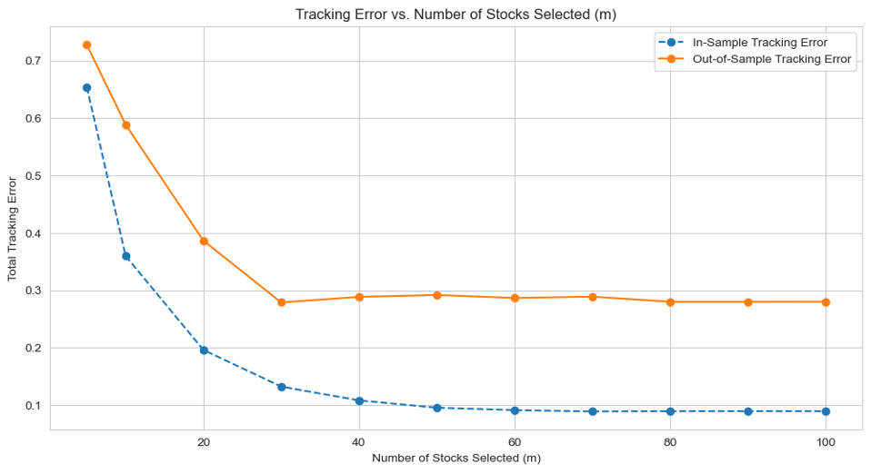
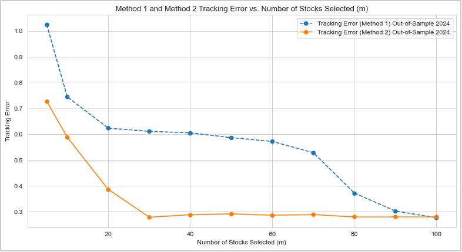
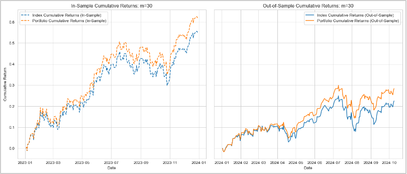
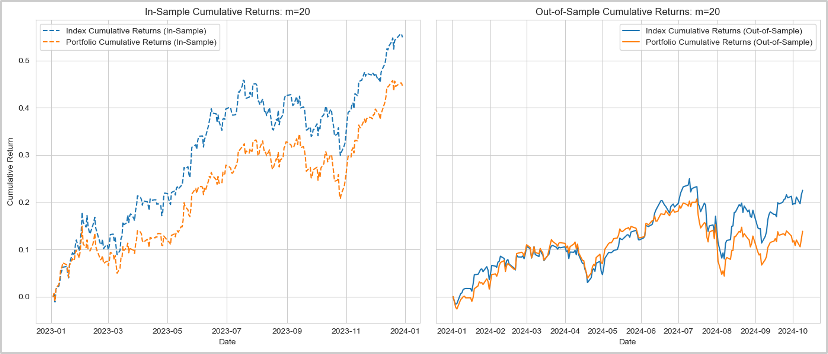

# Portfolio Optimizer Using IP

### Team Members
- Lindsay Bartol
- Pranav Garg
- Ramzi Kattan
- Advaith Shankar
- Gaurav Shukla

---

## Table of Contents
1. [Introduction](#introduction)
2. [Data Preparation](#data-preparation)
3. [Linear Programming Approach](#linear-programming-approach)
4. [Multiple Linear Programming Approach](#multiple-linear-programming-approach)
5. [Recommendations](#recommendations)

---

## Introduction

### Objective
The goal of this project is to create an optimized index fund portfolio using integer programming techniques to effectively track the NASDAQ-100 index, balancing representational accuracy and minimizing rebalancing complexity.

### Problem Statement
Constructing index-tracking funds traditionally involves high transaction costs and complex asset management. This project applies integer programming methods to select a simplified subset of stocks to replicate the performance of the NASDAQ-100, leveraging correlation among stock returns for optimal representation.

---

## Data Preparation

- **Data Loading:**
  - Loaded NASDAQ-100 daily stock price data from CSV files.

- **Handling Missing Data:**
  - Utilized linear interpolation, forward-fill, and back-fill methods.

- **Calculating Daily Returns:**
  - Calculated returns using percentage changes.

- **Constructing Correlation Matrix:**
  - Generated correlation matrix to quantify similarity between stock returns.

---

## Linear Programming Approach

- **Stock Selection:**
  - Selected a subset of stocks maximizing similarity to the NASDAQ-100 index using Integer Programming (IP).

- **Model Formulation:**
  - Maximized correlation-based similarity.

- **Decision Variables and Constraints:**
  - Binary variables indicating stock selection and representation.

- **Weight Selection:**
  - Minimized deviation between portfolio returns and index returns.

- **m Value Analysis:**
  - Evaluated performance with varying subset sizes (m).

- **2023 (In-Sample) vs. 2024 (Out-of-Sample) Performance:**
  - Assessed stability and accuracy across different years.

[alt text](image.png)

---

## Multiple Linear Programming Approach (MIP)

- **Big M Technique:**
  - Limited active stocks using Mixed-Integer Programming (MIP).

- **Constraints:**
  - Total weights constraint, non-negativity, and subset size constraints.

- **Objective Function:**
  - Minimized cumulative tracking error between portfolio and NASDAQ-100 returns.

- **MIP Conclusions:**
  - Achieved better tracking accuracy with fewer stocks compared to IP.

---

## Recommendations

### Preferred Model
- **Mixed-Integer Programming (MIP)** model recommended due to superior tracking accuracy despite higher computational complexity.

### Optimal Number of Stocks
- Recommend selecting **30 stocks** for the MIP model to achieve the optimal balance between tracking accuracy and portfolio complexity.

### Interesting Observations
- **LP:** Unexpected absence of large-cap stocks in smaller portfolios (m=5).
- **MIP:** Inclusion of high market-cap stocks, significantly reducing tracking errors.

---

### Summary
The MIP approach with 30 selected stocks offers an optimal solution, achieving close index tracking effectively with significantly reduced portfolio complexity compared to the full NASDAQ-100 holdings.

---

### Visualizations

---

---

### License
This project is licensed under the MIT License.